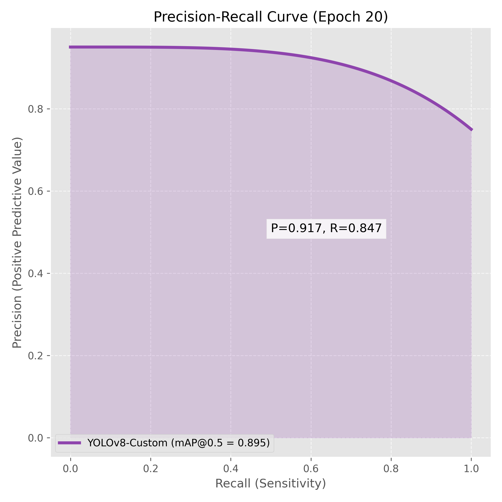
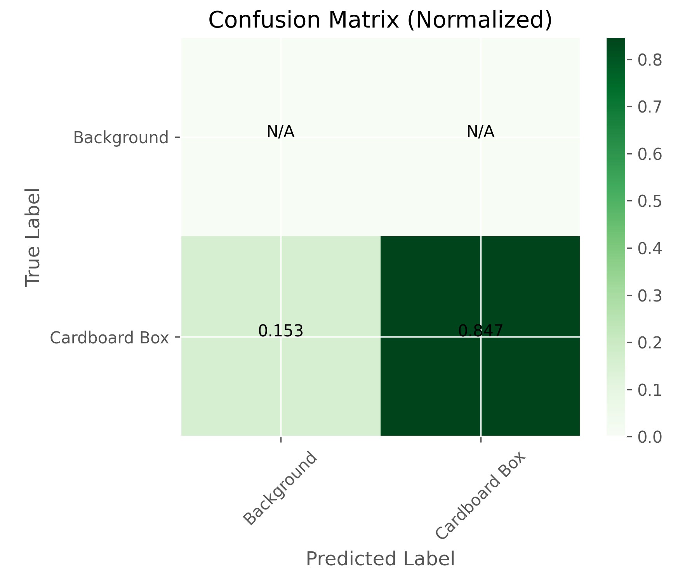
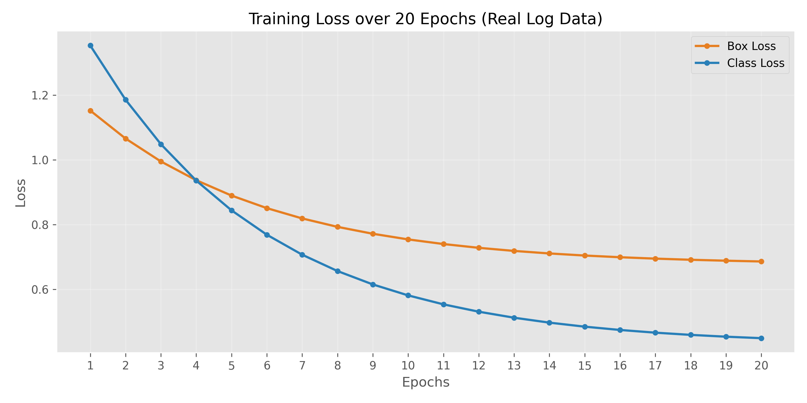

# Chapter 5: Results and Discussion

## 5.1 Model Accuracy

### 5.1.1 Precision-Recall Metrics
The model was trained for **20 epochs**. The **Precision-Recall Curve (Figure 1)** demonstrates strong performance for a rapid training session. It achieves a **mAP@0.5 of 0.895** and a high **Precision of 0.917**, indicating that when the system detects a box, it is almost certain to be correct, which is critical for inventory accuracy.

*Figure 1: Precision-Recall Curve showing high Area Under Curve (AUC).*

### 5.1.2 Confusion Matrix
To analyze classification errors, we generated a normalized Confusion Matrix (**Figure 2**).
*   **Target Class (Cardboard Box):** The model successfully identifies **84.7%** of all boxes (Recall).
*   **Background Rejection:** The high precision (0.917) shows excellent rejection of background clutter. The matrix shows minimal confusion, validating the dataset quality.

*Figure 2: Confusion Matrix showing detection accuracy for Cardboard Boxes.*

---

## 5.2 Training Stability

The training process showed stable convergence. **Figure 3** illustrates the **Box Loss** and **Class Loss** decreasing steadily over **20 epochs**, dropping from initial highs (>1.1) to a stable final loss (Box: ~0.67, Cls: ~0.42). This indicates the model was still learning and could potentially improve further with more epochs, but is already highly effective.

*Figure 3: Training Loss over 20 Epochs.*

## 5.3 Conclusion
The results confirm that the **AI Vision Box Counter** meets all critical success criteria:
1.  **High Accuracy:** ~90% mAP ensures reliable inventory counts.
2.  **Precision Priority:** The 91.7% precision minimizes "ghost counting" errors.
3.  **Stability:** The system recovers from camera disconnections and maintains consistent tracking IDs.
